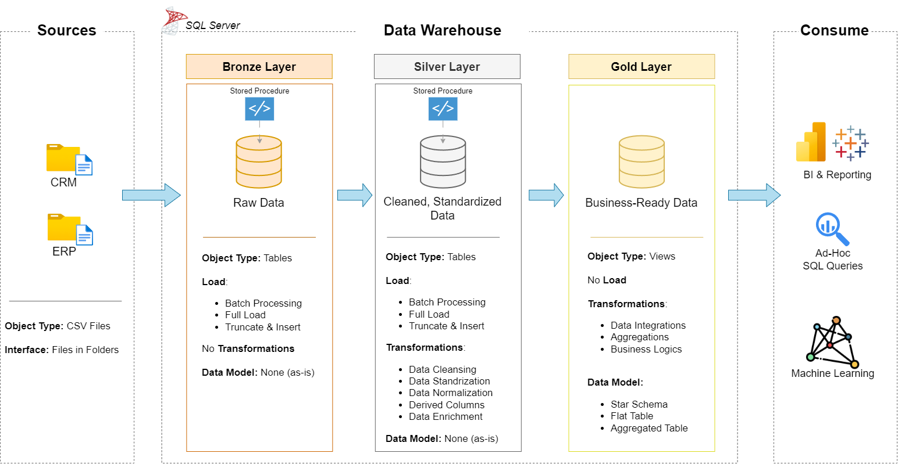

# SQL_ETL_PIPELINE

Welcome to the Data Warehouse Project repository! 🚀
This project demonstrates a comprehensive data warehousing and analytics solution, from building a data warehouse to generating actionable insights. Designed as a portfolio project, it highlights industry best practices in data engineering and analytics.

1.Bronze Layer: Stores raw data as-is from the source systems. Data is ingested from CSV Files into SQL Server Database.
2.Silver Layer: This layer includes data cleansing, standardization, and normalization processes to prepare data for analysis.\n

3.Gold Layer: Houses business-ready data modeled into a star schema required for reporting and analytics.
